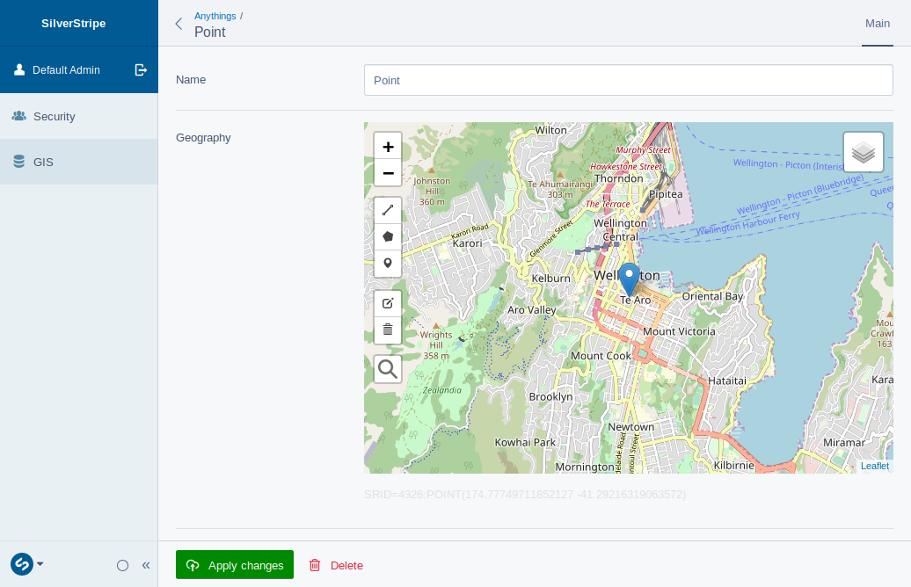
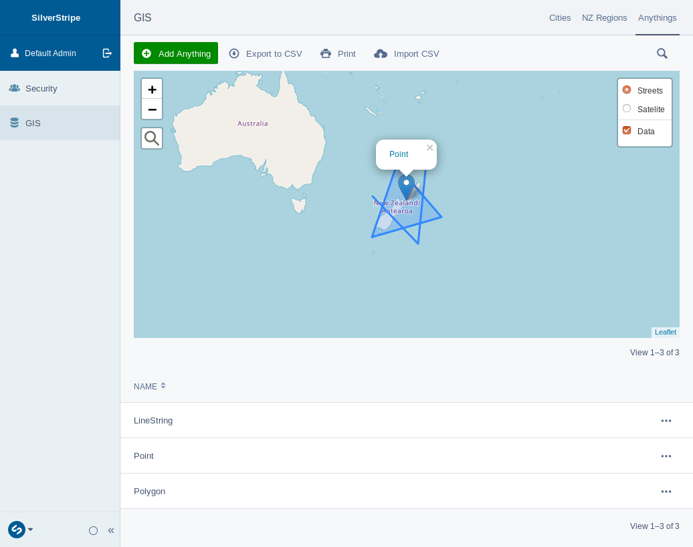
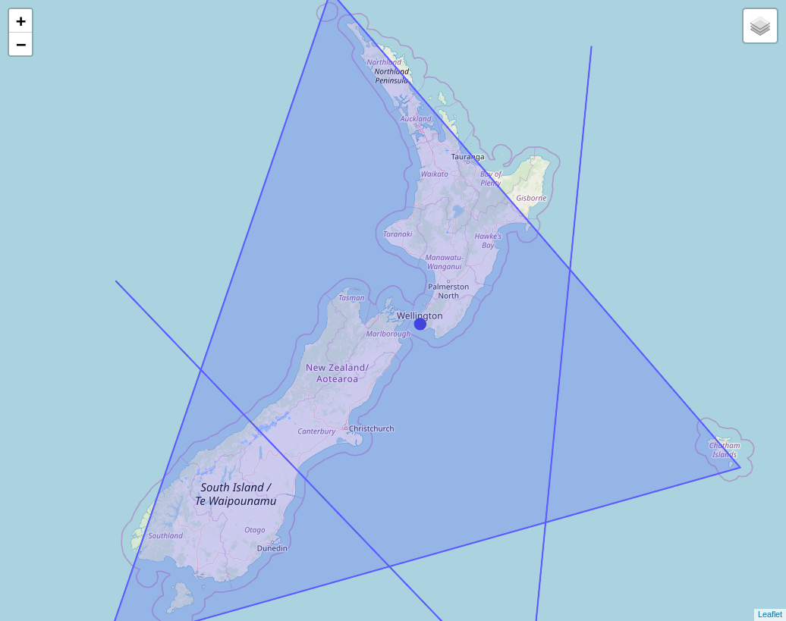

# SilverStripe GIS Module

GIS developer toolkit for SilverStripe

## Table of Contents

- [Features](#features)
- [Requirements](#requirements)
- [Installation](#Installation)
- [Configuration](#configuration)
- [GIS Class](#gis-class)
- [DataObject setup](#dataobject-setup)
- [MapField](#mapfield)
- [GridFieldMap](#gridfieldmap)
- [ORM filters](#orm-filters)
- [GeoJSONImporter](#geojsonimporter)
- [GeoJSON API](#geojson-api)
- [WebMapTileService](#webmaptileservice)

## Features

- __New field types:__ add geometries to DataObjects
- __New form fields:__ edit the new geo types using the MapField or add maps to GridFields in ModelAdmin
- __Configurable projections:__ support for alternative projections through proj4
- __Developer tools:__ heaps of useful helpers, e.g. for re-projecting, distance measuring, ewkt
- __MySQL and Postgres:__ supports Postgres with PostGIS, MySQL 5.7+, partial support for MariaDB
- __ORM integration__: DataList filters, e.g. to find intersecting DataObjects or within distance
- __GeoJSON imorter:__ import a GeoJSON source as DataObjects
- __GeoJSON web service:__ GeoJSON API for DataObjects
- __WMTS:__ render DataObjects to ZXY tiles e.g. for a leaflet frontend

## Requirements

- MySQL 5.7+ or Postgres with PostGIS extension
- SilverStripe framework 4

## Installation

It's recommended to use composer to install the module

    $ composer require smindel/silverstripe-gis
    $ vendor/bin/sake dev/build flush=all

__MySQL__ natively supports geodetic coordinate systems for geometries since version 5.7.6.

__MariaDB__ does not currently support ST\_Distance\_Sphere(), so that you cannot calculate distances.

When using __Postgres__ you have to install PostGIS. On Ubuntu and Debian run the folloing commands:

    $ sudo apt-get install postgis
    $ sudo apt-get install postgresql-9.5-postgis-scripts
    $ sudo apt-get install postgresql-9.5-postgis-2.2
    $ sudo -u postgres psql SS_gis -c "create extension postgis;"

(replace 'SS\_gis' with your db name)

## Configuration

silverstripe-gis, like any other SilverStripe module, can be [configured](https://docs.silverstripe.org/en/4/developer_guides/configuration/configuration/) using YAML files, the Config class or private static properties of Configurables. Check out the following sections to see what can be configured.

## GIS Class

__Methods:__

- `float GIS::distance(Geometry $geo1, Geometry $geo2)`
  Returns the distance of the to Geometries in meters.
- `array GIS::split_ewkt(string $ewkt)`
  Splits an $ewkt string into the SRID and WKT
- `string GIS::get_type(array $array)`
  Returns the shape type of a geometry in $array representation
- `array GIS::reproject_array(array $array, int $srid)`
  Re-projects a geometry in $array representation to the given $srid
- `array GIS::to_array(string $ewkt)`
  Transforms a geometry in $ewkt representation into array representation
- `string GIS::array_to_ewkt(array $array)`
  Transforms a geometry in $array representation into eWKT representation
- `string GIS::of(string $dataobjectClass)`
  Returns the name of the geometry property of the given dataobjectClass

__Configuration:__

- `GIS::$default_srid = 4326`
  Default spacial reference sytem id
- `GIS::$projections`
  [proj4 definitions](https://epsg.io/) for SRIDs 4326, 3857 and 2193 are preconfigured

## DataObject setup

Add Geometry attributes like any other attribute using the new type Geometry:

app/src/Model/City.php

    <?php

    use SilverStripe\ORM\DataObject

    class City extends DataObject
    {
        private static $db = [
            'Name' => 'Varchar',
            'Location' => 'Geometry',
        ];
    }

__Configuration:__

- `[DataObject]::$default_geo_field = undefined`
  The geo aspect of a DataObject is defined by the first field of type Geometry. If there is more than one Geometry field, you can specify, which one to use for things like MapFields.
- `[DataObject]::$geojsonwebservice = undefined`
  Set to true to turn on the GeoJSON webservice for the DataObject. If you need more control you can set it to an associative array with the following keys:
  - geometry_field = undefined (witch field to use for the Geometry, by default the first one found is used)
  - searchable_fields = undefined (by default searchable fields are used)
  - code = undefined (set to SilverStripe permission codes to restrict access e.g. ADMIN)
  - record_provider = undefined (callable to return the record to be used for the webservice)
  - property_map = undefined (GeoJSON feature properties, summary fields if not specified)
- `[DataObject]::$webmaptileservice = undefined`
  Set to true to turn on the GeoJSON webservice for the DataObject. If you need more control you can set it to an associative array with the following keys:
  - geometry_field = undefined (witch field to use for the Geometry, by default the first one found is used)
  - searchable_fields = undefined (by default searchable fields are used)
  - code = undefined (set to SilverStripe permission codes to restrict access e.g. ADMIN)
  - record_provider = undefined (callable to return the record to be used for the webservice)
  - tile_size = 256 (tile width and height in pixel)
  - tile_buffer = 5 (extend the area for which DataObjects are sent to renderer beyond the size of the tile in pixel)
  - wrap_date = true (wrap around the dateline)

## MapField

After adding a new geo type to your DataObjects db fields, the form scaffolder automatically gives you a MapField to your edit form.

It supports editing the geo types POINT, LINESTRING and POLYGON. You can deactivate types you don't want to support in your DataObject:

    public function getCMSFields()
    {
        $fields = parent::getCMSFields();
        $fields->dataFieldByName('Location')->setControl('polygon', false)->setControl('polyline', false);
        return $fields;
    }

The above example disables the POLYGON and LINESTRING buttons for the geo db field 'Location'.

__Methods:__

- `MapField MapField::setControl(string $shapeType, boolean $display = false)`
  $display or hide controls for individual $shapeTypes. Possible values are 'marker' for POINTS, 'polyline' for LINESTRING and 'polygon'.

__Configuration:__

- `MapField::$default_location = [174.5, -41.3]`
  Empty MapField's _and_ GridFieldMap's are centred to this location

## GridFieldMap

This module doesn't come with an admin interface out of the box. But if you are using [silverstripe-admin](https://github.com/silverstripe/silverstripe-admin/), adding one is simple. Create a ModelAdmin and add the new GridFieldMap component to visualise a DataList on a map:

app/src/Admin/GISAdmin.php

    <?php

    use SilverStripe\Admin\ModelAdmin;
    use Smindel\GIS\Forms\GridFieldMap;
    use Smindel\GIS\GIS;

    class GISAdmin extends ModelAdmin
    {
        private static $url_segment = 'gis';

        private static $menu_title = 'GIS';

        private static $managed_models = [
            City::class,
        ];

        public function getEditForm($id = NULL, $fields = NULL)
        {
            $form = parent::getEditForm($id, $fields);

            if (
                ($geometry = GIS::of($this->modelClass))
                && ($field = $form->Fields()->dataFieldByName($this->sanitiseClassName($this->modelClass)))
            ) {
                $field->getConfig()->addComponent(new GridFieldMap($geometry));
            }

            return $form;
        }
    }

## ORM filters

To find all DataObjects __within__ a polygon:

    $cities = City::get()->filter('Location:WithinGeo', GIS::array_to_ewkt([[[10,30],[40,40],[40,20],[20,10],[10,30]]]));

To find all DataObjects __intersecting__ with a given geometry:

    $cities = City::get()->filter('Location:IntersectsGeo', GIS::array_to_ewkt([[[10,30],[40,40],[40,20],[20,10],[10,30]]]));

To find all DataObjects __within a certain distance__ in meters of a given geometry:

    $cities = City::get()->filter('Location:DWithinGeo', [GIS::array_to_ewkt([10,30]), 100000]);

To compute the __distance__ in meters between two given geometries:

    $distance = GIS::distance(GIS::array_to_ewkt([10,30]), GIS::array_to_ewkt([40,40]));

## GeoJSONImporter

To import GeoJSON programmatically use the GeoJsonImporter.

__Methods:__

- `void GeoJSONImporter::import(string $class, string $geoJson, array $propertyMap = null, string $geometryProperty = null, callable $featureCallback = null)`
  Supply the DataObject's $class, the raw $geoJson string (e.g. file_get_contents($filename)), optional $propertyMap to re-map feature to DataObject properties, $geometryProperty to use (by default the first one found is used)

## GeoJSON API

After [setting up your DataObject for this service](#dataobject-setup) you can acces the endpoint:

    http://yourdomain/geojsonservice/CLASS?QUERY

Just replace 'CLASS' with a sluggified name (replace namespace backslashes with dashes) of your DataObject's class and optionally append a query specifying a map of property names with search values

E.g.

    http://yourdomain/geojsonservice/VendorName-ProductName-DataObjectClassName?MyProperty:PartialMatch=searchterm&...

## WebMapTileService

This service is configured through your [DataObject class](#dataobject-setup). The endpoint for the tiles is:

    http://yourdomain/webmaptileservice/CLASS/Z/X/Y.png?QUERY

E.g.

    http://yourdomain/webmaptileservice/VendorName-ProductName-DataObjectClassName/6/63/39.png?MyProperty:PartialMatch=searchterm&...

If you set the special query parameter debug=1 the tile will be rendered with debugging info like borders, Z, X and Y values and the number of records that have been rendered.

__Configuration:__

- `TileRenderer::$class = Smindel\GIS\Service\GDRenderer`
  Set to Smindel\GIS\Service\ImagickRenderer for more rendering features
